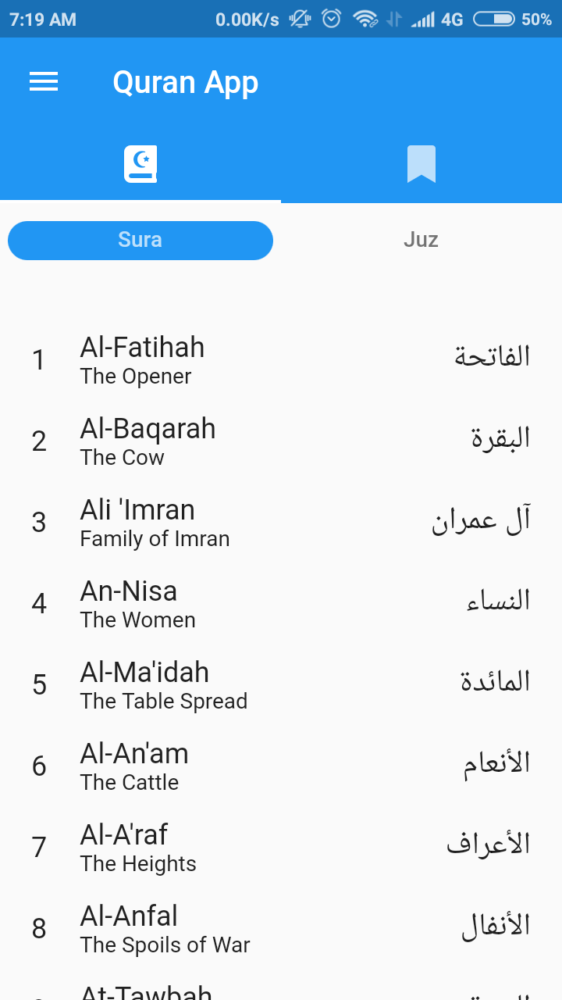
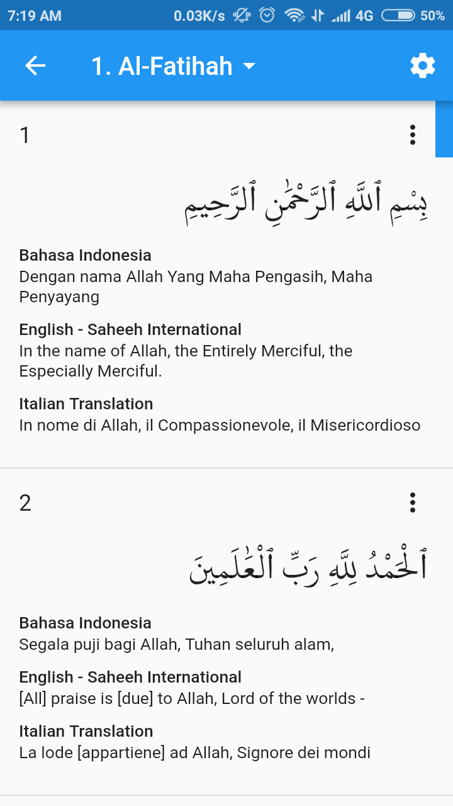
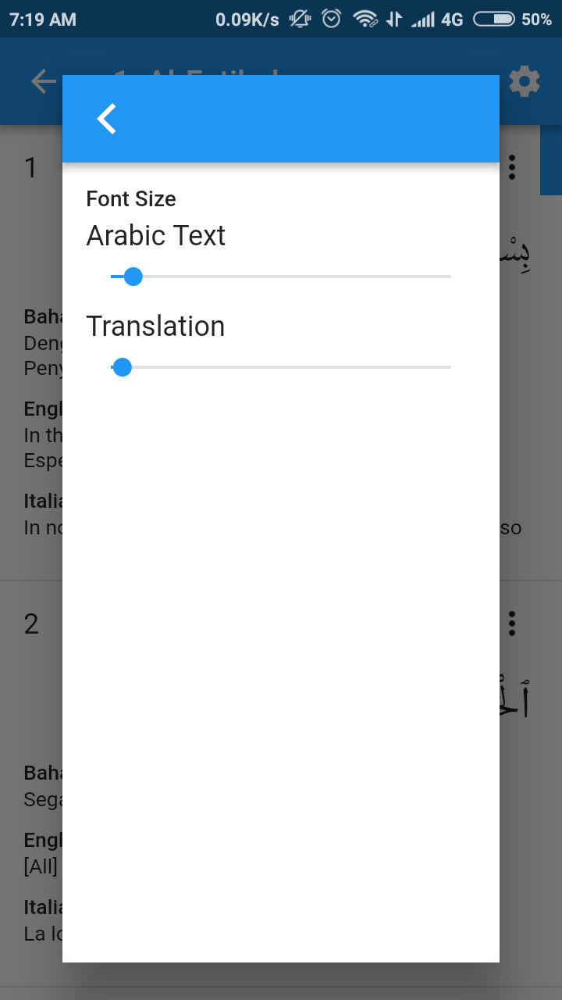
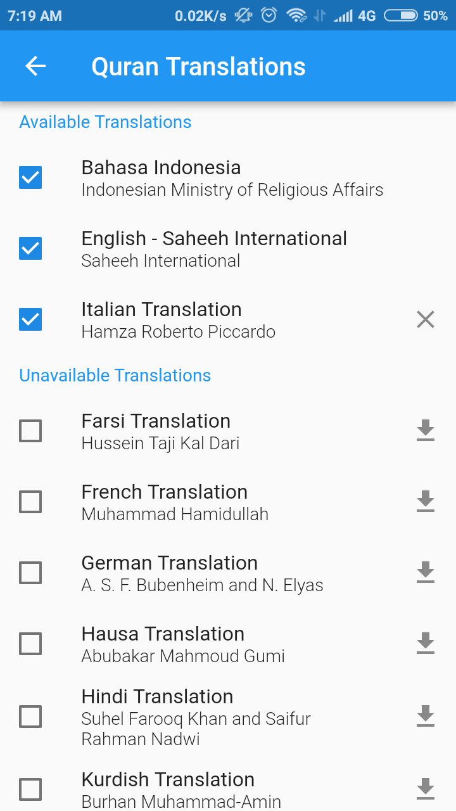
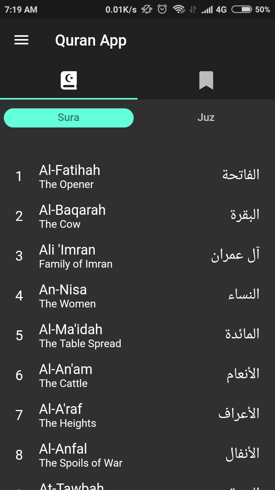
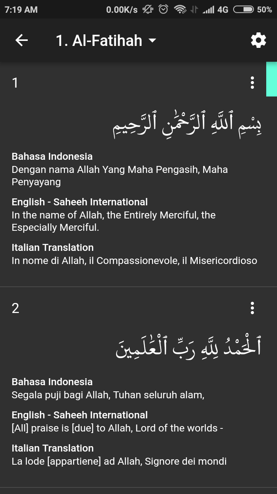
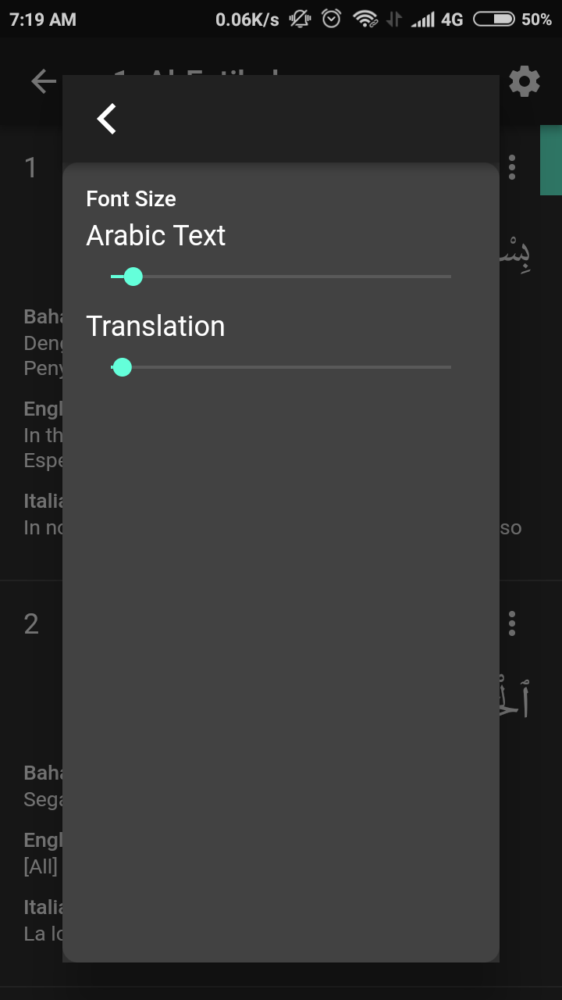
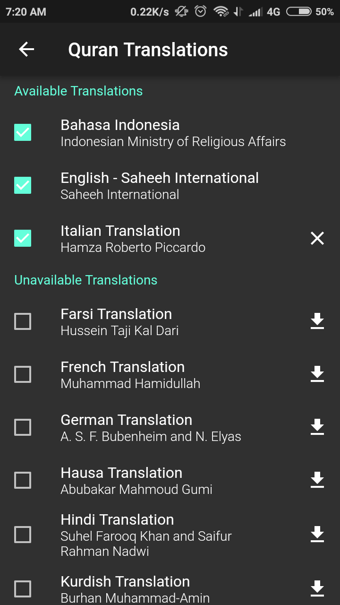

# quran_app

This app is an Al-Quran app written with Flutter (Android and iOS).

Quran text is using quran-uthmani from [Tanzil](http://tanzil.net)

**Light and Dark theme are available**

**Supported languages**
- English
- Indonesian

## Screenshot (Light theme)

  
   
  
  

## Screenshot (Dark theme)

  
   
  
  

