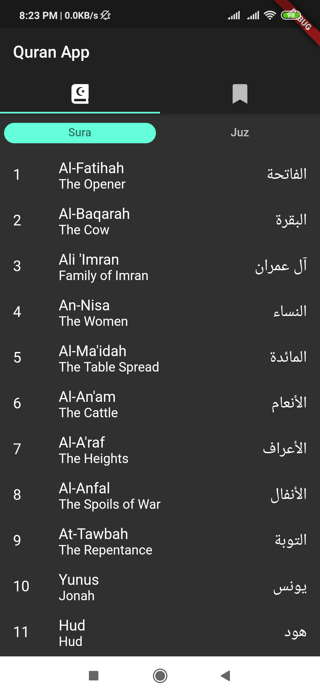
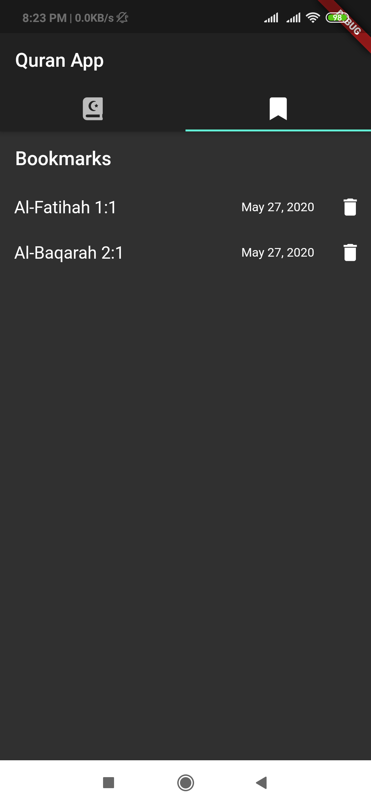
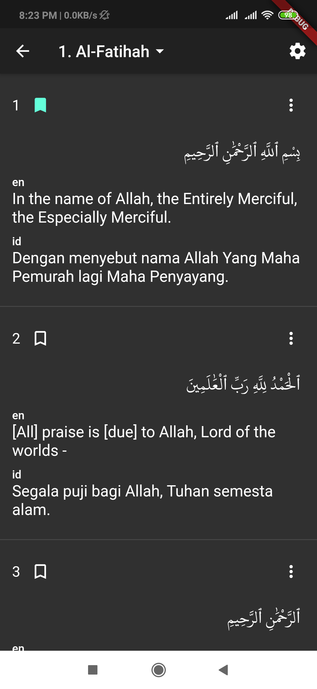
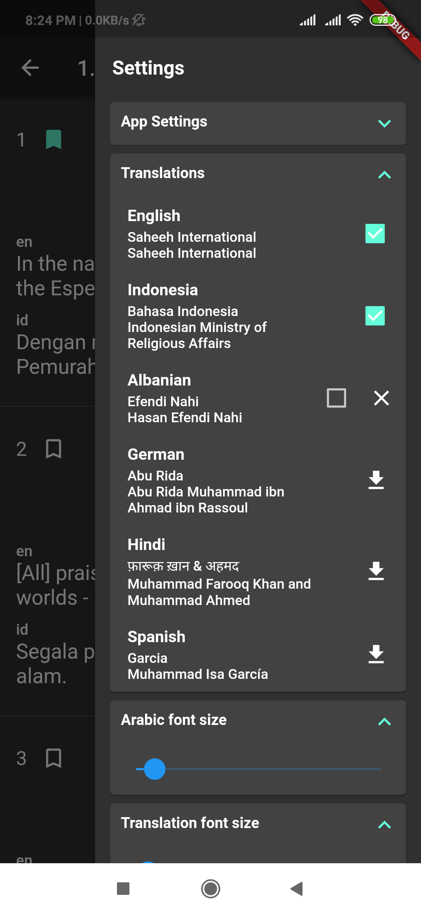
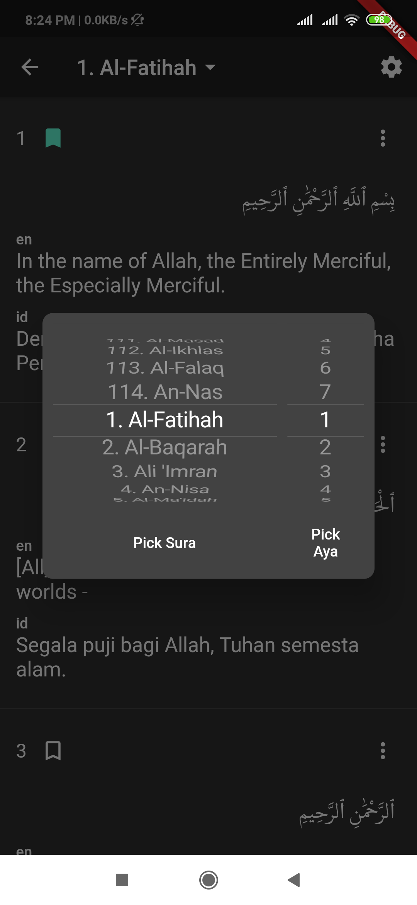
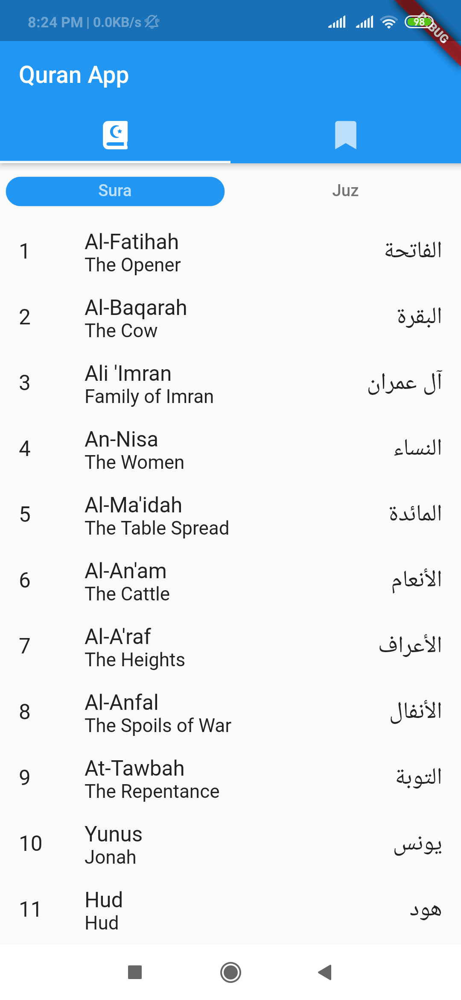
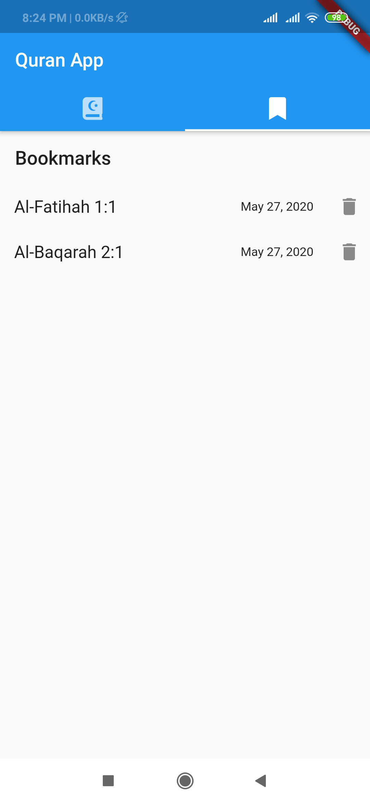
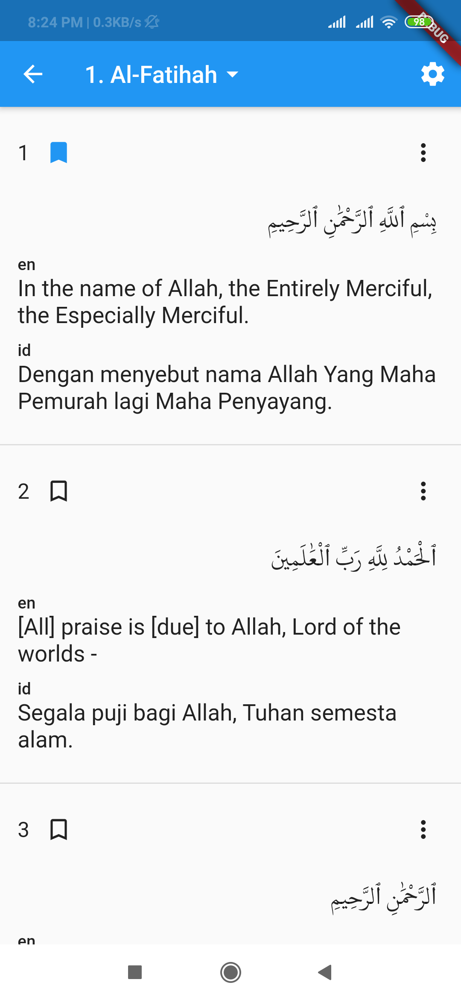
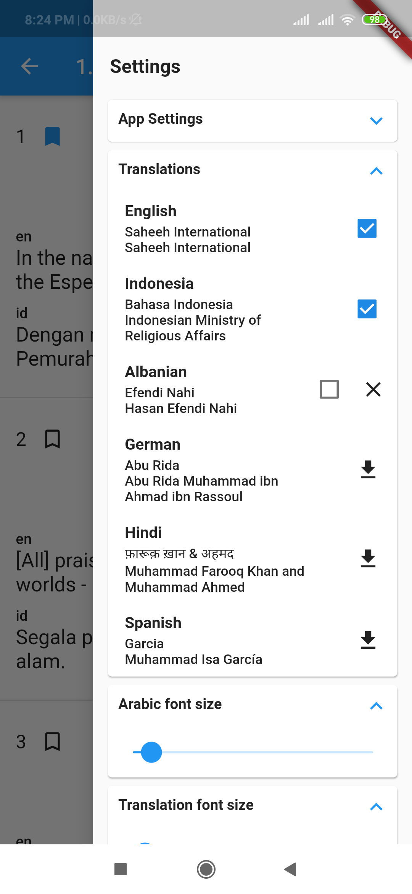

# quran_app

Quran app built with Flutter

### Features:
- Support dark and ligth theme
- Multiple translations
- Bookmark ayat
- And some basic features

There is still so much to improve (playing audio, ayat of the day, etc) if you want to contribute whether it's a feature or a bug you can send a Pull Request, maybe I can check it out

## Screenshot (Dark theme)

  
   
  
  
  

## Screenshot (Light theme)

  
   
  
  
  

